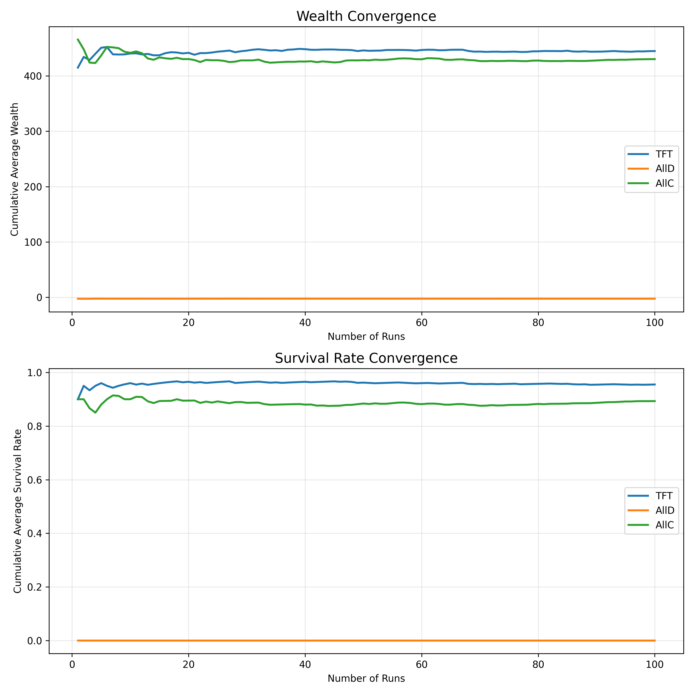
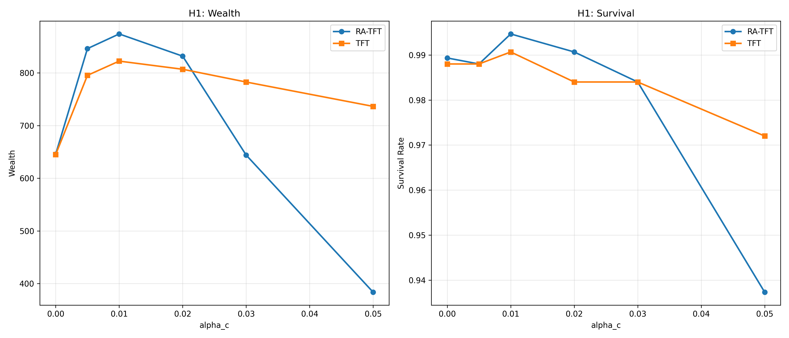
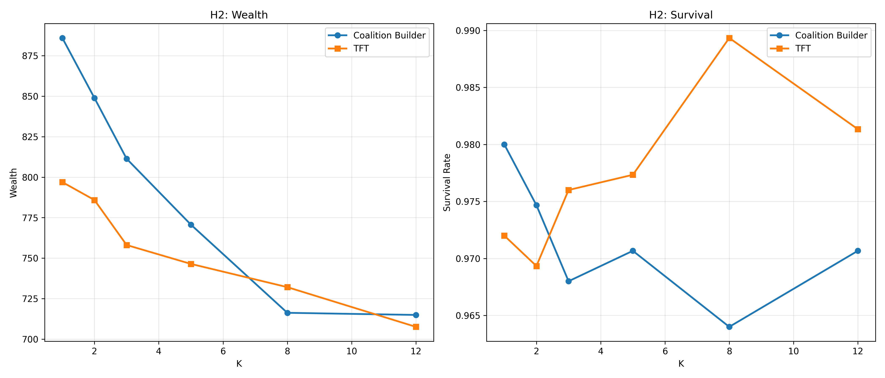
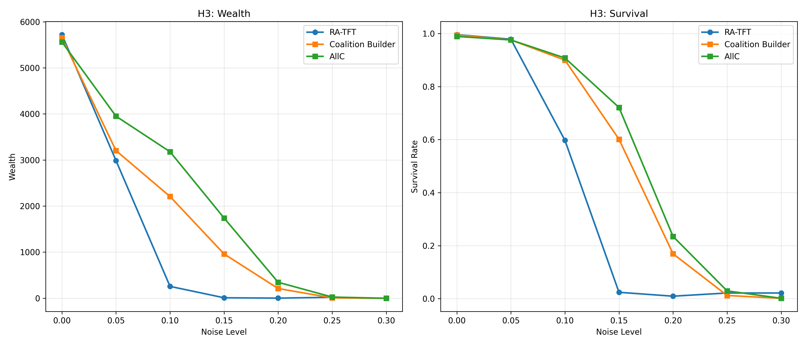

# **Steal or Refrain: A Monte Carlo Simulation of Repeated Cooperation and Defection**
This game is based on a modified version of the Prisoner’s Dilemma (see citation [3]).

**Team Member:**
Wenqian Chen

**Project Type:**
Type I: Formal Critique and Improvement of a Published Data Analysis

To reproduce the results, run **experiment.py** and **validation.py**.
The data structures and design details are documented in datastructure.md.

**Note**: I removed the welfare system design from the final model. A full welfare mechanism is hard to define and implement in a simple way, and would add significant complexity to both analysis and algorithm design. 
Instead, we keep a basic elimination rule: players with negative wealth are removed from the game.

Papers cited in [7–10] mainly provide the theoretical motivation for our design rather than direct code implementations. We do not copy algorithms from these works.

For example, these papers emphasize that mutual cooperation strengthens long-term relationships, while unilateral defection is often more damaging than mutual defection.
In our model, this idea is implemented at the system level through the network update rules.
Specifically, network strength increases only when both players cooperate, while any outcome involving defection reduces trust symmetrically.
Many aspects of our environment design are inspired by the theoretical insights from these papers.
---

## **Project Description**

This project critiques and substantially extends prior open-source Prisoner’s Dilemma simulations (see citations [4] and [6]).

**Limitations of existing simulations:**
* Round-robin pairing 
* Simplified noise models
* Classical strategies only (TFT, GRIM, AllC, AllD)
* No environmental information systems

**This project adds:**
* Reputation system tracking cooperation history (information only)
* Network weights capturing pairwise relationship strength
* Wealth dynamics with bankruptcy.
* New strategies (RA-TFT, Coalition Builder) that exploit environmental information through **selective cooperation**

Players interact over 1000 (default) rounds. We run 50 Monte Carlo trials to evaluate how environmental mechanisms alter outcomes beyond classical Prisoner’s Dilemma results.

---

## **Base Payoff Matrix**

|               | B Refrain (C) | B Steal (D) |
| ------------- |---------------|-------------|
| A Refrain (C) | (2, 2)        | (-5, 6)     |
| A Steal (D)   | (6, -5)       | (-4, -4)    |

The matrix follows the classcial Prisoner’s Dilemma problem requirements:   $T > R > P > S \quad \text{and} \quad 2R > T + S$ 

The use of negative payoffs is inspired by citation [5], which introduces negative outcomes in a power-based Prisoner’s Dilemma setting. In contrast, we use a fixed payoff matrix, and our main focus is on adding two systems: reputation awareness and network memory.

---

## **Rules**

### **Base Rules**
1. Two players paired for T rounds (default: 1000)
2. Each round: choose Refrain (C) or Steal (D)
3. Payoffs follow base matrix
4. Players observe opponent history(local) and reputation(global)
5. Strategies fixed within simulation


### **New Environmental Rules**

**6. Reputation System**

$$r_i \leftarrow \min(r_{\max}, r_i + \alpha_c) \quad \text{after cooperation}$$
$$r_i \leftarrow \max(r_{\min}, r_i - \alpha_d) \quad \text{after defection}$$

- **Observable by all players**
- **Does not affect matching probability**
- **Only RA-TFT strategy use this information, others ignore it (TFT, AllC, AllD, etc)**

**7. Network-Based Information**

Each pair maintains edge weight $w(i,j)$:

$$w(i,j) \leftarrow w(i,j) + \gamma \quad \text{after cooperation}$$
$$w(i,j) \leftarrow \max(0, w(i,j) - \delta) \quad \text{after defection}$$

- **Observable by all players**
- **Does not affect matching probability**
- **Only Coalition Builder strategy use this information, others ignore it**

**8. Wealth & Bankruptcy**

$$W_i \leftarrow W_i + \pi_i$$

If $W_i < W_{\text{threshold}}$, the player is permanently removed from the game.

#### **Matching Algorithm**

**Pure random pairing via random.shuffle()**, each round:
1. Shuffle all active (non-bankrupt) players
2. Pair adjacent players: (players[0], players[1]), (players[2], players[3])...
3. Unpaired player (if odd number) sits out that round

**Critical Design Choice:**
1. Reputation and network are **information only**
2. Matching is **not** affected by reputation/network weights
3. Assortative matching emerges through **strategic behavior** 
  (Coalition Builder selectively cooperates), not system-imposed 
  preferential pairing

---

## **Strategies**

### **Baseline Strategies**
1. **AllC**: Always cooperate
2. **AllD**: Always defect
3. **TFT**: Tit-for-tat, start by cooperating, then mirror opponent's last move
4. **GRIM**: Cooperate until first defection, then always defect
5. **GTFT**: Forgiving TFT (forgiveness probability p)
6. **RAND**: Random 50/50

### **New Strategies**

**7. Reputation-Aware TFT (RA-TFT)**

$$
\text{Action} =
\begin{cases}
\text{GTFT}, & \text{if } r_j > r_{\text{threshold1}}, \\[6pt]
\text{TFT},  & \text{if } r_{\text{threshold2}} < r_j \le r_{\text{threshold1}}, \\[6pt]
D,           & \text{if } r_j \le r_{\text{threshold2}} 
\end{cases}
$$

**REMINDER**:
 
- GTFT means that coorperate first, if face betry, then probability p to coopertate and (1-p) do TFT
- TFT means that Coorperate first, then copy opponent's previous action (like if its opponent choose coorperate, they coorprate, if opponent choose betry/defect, then they also choose betry/defect)
- Reputation score is accumulated from a player;s previous behaviors

Integrates reputation into TFT logic. 

**8. Coalition Builder**

Identifies allies using network edge weights:

$$
\text{Action}(i,j) = 
\begin{cases}
C, & \text{if } w(i,j) \geq K_{\text{threshold}} \text{ (high-trust partner)} \\
\text{TFT}, & \text{otherwise (new partner)}
\end{cases}
$$

**Mechanism:**
- Cooperates unconditionally with high-trust partners ($w \geq K$)
- Uses TFT with new partners

---

## **Randomized Variables**
* Player pairing (random.shuffle() each round)
* Action noise ε (move flip probability)
  - Default: ε = 0.05 (5% error rate)
  - Models miscommunication/signal errors

## **Controlled Variables**
* Payoff matrix
* Initial wealth W₀ = 20.0 (equal start for all players)
* Monte Carlo trials (N = 100/50)
* GTFT forgiveness p
* Reputation weights $\alpha_c, \alpha_d$
* Network weights $\gamma, \delta$
* Broke threshold $W_{\text{threshold}}$
* Coalition threshold K

---

## **Three Phases**

### **Phase 1: Design**

Components:
* Base PD model (Steal/Refrain)
* Reputation system
* Network matching
* bankruptcy mechanics

### **Phase 2: Validation**
**remainder**
- **AllC**: Always cooperate
- **AllD**: Always defect
- **TFT**: Tit-for-tat, start by cooperating, then mirror opponent's last move

**Sanity Checks:**
* **All players use the same strategy**

  - AllC (everyone cooperates): high average wealth, no bankruptcies
  - AllD (everyone defects): near-zero or negative wealth, many bankruptcies
    These results match standard Prisoner’s Dilemma intuition.

* **Zero rounds**

  - When the number of rounds is set to zero, all players keep their initial wealth and no one goes bankrupt.
    This confirms the simulation does not introduce unintended side effects.

* **Extreme noise**

  - With no noise, TFT achieves high wealth.
  - With full noise, TFT collapses and behaves close to random play.
    This confirms that the noise mechanism is implemented correctly.

  

**convergence**

To ensure that our results are not driven by randomness in a single run, we run the simulation repeatedly 100 times and track the cumulative average wealth and survival rate.


The figure below shows that:

* Wealth and survival rates stabilize after enough runs.
* TFT consistently outperforms AllC in survival, while AllD collapses quickly.
* The system converges to stable values, indicating that our experimental results are reliable.




### **Phase 3: Experiments**

---

### Hypotheses 
#### Key Point

The parameters used in our experiments (e.g., reputation update rates ($\alpha_c$, $\alpha_d$), network threshold (K), and noise level) **do not represent any real-world quantities**. Instead, they serve as **designed control knobs** that allow us to vary the *intensity* of reputation signals, network selectivity, and environmental uncertainty.  So that the goal is not to identify precise optimal parameter values, but to examine **qualitative and structural changes in system behavior** as these intensities increase.

**H1**: Under a reputation information system, players who take others’ reputation scores into account (RA-TFT) will achieve higher payoffs and survival rates than players who do not consider reputation and only copy the opponent’s previous action (TFT). However, excessive sensitivity to reputation may cause cooperation to collapse.

**REMINDER**:
- GTFT: Cooperates first. After facing betrayal, cooperates with probability p, and with probability 1−p behaves like TFT.    
- TFT: Cooperates first, then copies the opponent’s previous action.
- Reputation score is accumulated from a player’s past behaviors.
- RA-TFT is my originally designed strategy. It is like TFT with reputation thresholds: it cooperates more with high-reputation players(GTFT), plays normal TFT with medium-reputation players, and defects against low-reputation players.

This list defines different levels of reputation signal strength by jointly scaling the update rates for cooperation and defection.
```python
rep_signals = [
    ('no_rep', 0.0, 0.0),
    ('weak_rep', 0.005, 0.01),
    ('weak_moderate_rep', 0.01, 0.02),
    ('moderate_rep', 0.02, 0.04),
    ('moderate_strong_rep', 0.03, 0.06),
    ('strong_rep', 0.05, 0.10),
]
```
            
The results exhibit a strong non-linear relationship between reputation strength and cooperative performance.
RA-TFT significantly outperforms TFT under weak-to-moderate reputation signals, reaching peak performance around weak_moderate_rep level. However, as reputation sensitivity increases, RA-TFT performance deteriorates sharply in both wealth and survival. Excessive punishment and exclusion triggered by overly strong reputation signals collapse cooperation.

These findings support H1 and demonstrate that reputation systems are beneficial only within a limited operating range.




**H2**: Under a network memory system, players who remember past interactions with specific partners (Coalition Builder) will earn higher payoffs than players who copy opponents' previous action (TFT). However, when the selection threshold becomes too strict, interaction opportunities decrease and the advantage may disappear.

**Reminder (Coalition Builder behavior):**

- Cooperates unconditionally with high-trust partners (($w \ge K$))
- Uses TFT when interacting with new partners
- TFT: Cooperates first, then copies the opponent’s previous action.


The network threshold (K) only controls how strict partner selection is.
Smaller values of (K) mean it is easier to form stable cooperative relationships, while larger values of (K) represent stricter filtering rather than any real-world trust score.


```python
thresholds = {
    'very_easy': 1.0,
    'easy': 2.0,
    'moderate': 3.0,
    'moderate_hard': 5.0,
    'hard': 8.0,
    'very_hard': 12.0,
}
```
The results show that Coalition Builder consistently achieves higher average wealth than TFT under low to moderate thresholds.
As $K$ increases, the performance gap gradually shrinks, and under very strict thresholds the advantage almost disappears. This suggests that network memory is beneficial, but overly strict partner selection limits interaction opportunities and reduces its effectiveness.



Both H1 and H2 show that a moderate level of system design helps conditional cooperation strategies improve their performance in this game. Based on this, we want to test whether combining the two systems can reduce the destructive effects caused by high environmental noise. This leads to our H3.

**H3**: It is common sense in game theory that increasing environmental noise significantly harms conditional cooperation strategies. However, combining reputation awareness and network memory can reduce the damage caused by high noise, especially at moderate noise levels that we showed to be effective earlier.

```python
noise_levels = [0.0, 0.05, 0.10, 0.15, 0.20, 0.25, 0.30]
```

As noise increases, all strategies experience declining wealth and survival. RA-TFT collapses the earliest, as noisy defections frequently trigger mistaken retaliation.

Coalition Builders perform better than RA-TFT at moderate noise levels by selectively disengaging from unreliable partners, while unconditional cooperation (AllC) maintains the highest survival under moderate-to-high noise due to its tolerance to miscoordination.

At extreme noise levels, cooperation becomes unsustainable across all strategies, and outcomes converge toward near-total collapse.

This partially rejects Hypothesis 3, because our system is still built on conditional cooperation. Under high noise, reputation and network memory are no longer reliable, so the system cannot effectively prevent collapse.



---

## **References**

* 1. [https://en.wikipedia.org/wiki/Game_theory](https://en.wikipedia.org/wiki/Game_theory)
* 2. [https://en.wikipedia.org/wiki/Prisoner%27s_dilemma](https://en.wikipedia.org/wiki/Prisoner%27s_dilemma)
* 3. [https://blogs.cornell.edu/info2040/2012/09/21/split-or-steal-an-analysis-using-game-theory/](https://blogs.cornell.edu/info2040/2012/09/21/split-or-steal-an-analysis-using-game-theory/)
* 4. [https://github.com/Axelrod-Python/Axelrod](https://github.com/Axelrod-Python/Axelrod)
* 5. [https://github.com/josephius/power](https://github.com/josephius/power)
* 6. [https://github.com/jenna-jordan/Prisoners-Dilemma](https://github.com/jenna-jordan/Prisoners-Dilemma)
* 7. Bergstrom, T. (2003). *The Algebra of Assortative Encounters and the Evolution of Cooperation*.
  UC Santa Barbara, Department of Economics.  
  Retrieved from https://escholarship.org/uc/item/03f6s9jt
* 8. Nowak, M. A., & Sigmund, K. (1998). *Evolution of indirect reciprocity by image scoring*. Nature, 393(6685), 573–577.  
  Retrieved from https://www.nature.com/articles/31225
* 9. Leibo, J. Z., Zambaldi, V., Lanctot, M., Marecki, J., & Graepel, T. (2017). 
  *Multi-agent Reinforcement Learning in Sequential Social Dilemmas*. 
  arXiv preprint arXiv:1702.03037. 
  Retrieved from https://doi.org/10.48550/arXiv.1702.03037
* 10. Hilbe, C., Schmid, L., Tkadlec, J., Chatterjee, K., & Nowak, M. A. (2018). 
  *Indirect reciprocity with private, noisy, and incomplete information*. 
  Proceedings of the National Academy of Sciences, 115(48), 12241–12246. 
  https://doi.org/10.1073/pnas.1810565115
---


